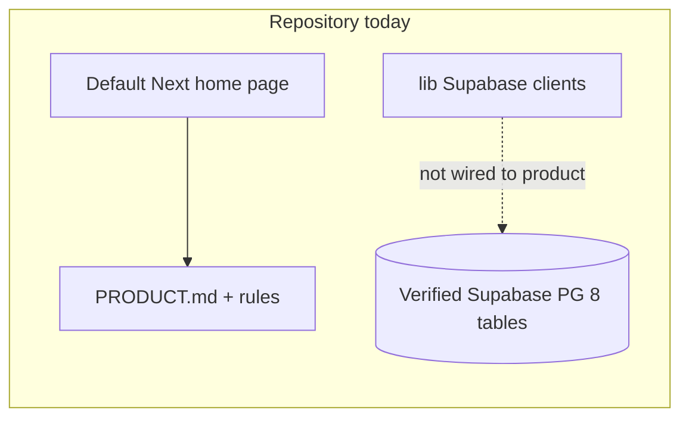
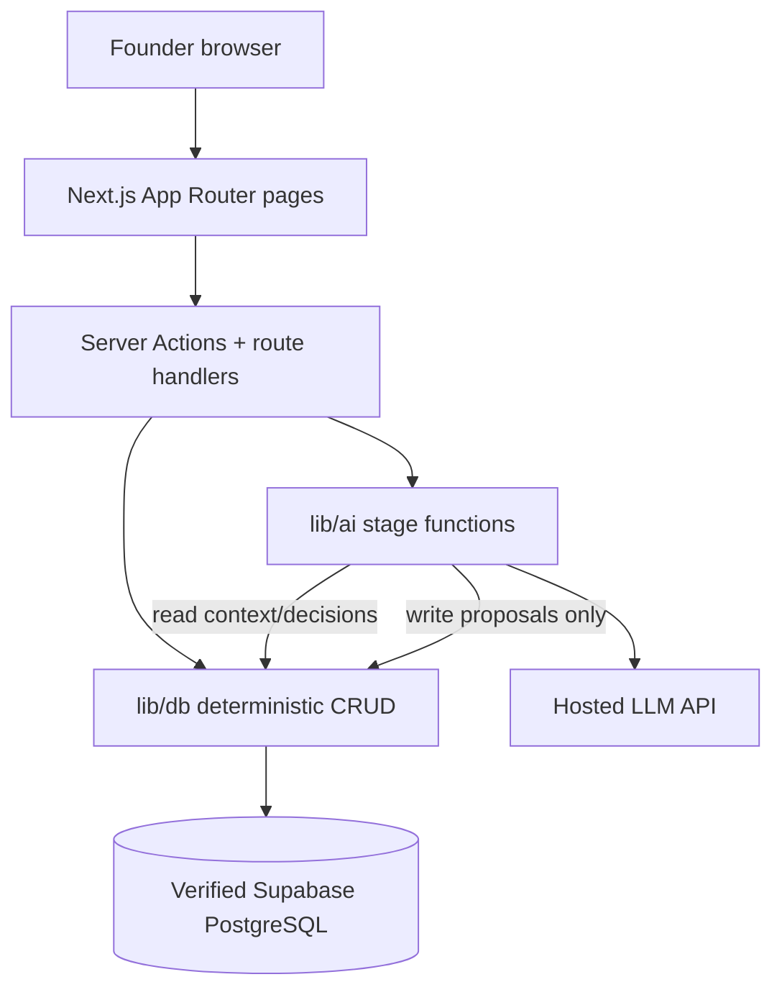

# Living Brand Intelligence — Hackathon MVP Implementation Plan

## Plan constraints (locked before implementation)

1. **Database**: Schema is **already created and verified** on remote Supabase. **Do not redesign or recreate** it. The eight tables below are the **source of truth** for the application. Change DDL **only** if implementation reveals a **concrete incompatibility** with product docs.
2. **Verified tables**: `startups`, `context_items`, `brand_decisions`, `context_relationships`, `decision_context_links`, `decision_relationships`, `change_analyses`, `change_analysis_impacts`.
3. **Shadcn/Base UI**: **Initialization is complete** (Base UI, Nova preset, Lucide, Geist). Add **individual** UI components **only when a screen needs them**.
4. **Supabase packages**: Already installed — `@supabase/supabase-js`, `@supabase/ssr`. Do not re-install for Milestone 1.
5. **Environment**: Application loads **only** from project root [.env.local](.env.local) with `NEXT_PUBLIC_SUPABASE_URL` and `NEXT_PUBLIC_SUPABASE_PUBLISHABLE_KEY`. **Do not create or depend on** `docs/.env.local`.
6. **Milestone 1 exclusions**: **No** root `middleware.ts`, **no** authentication UI, **no** LLM SDK, **no** AI implementation.
7. **Implementation order** (fixed): **Foundation → Discovery → Structure → Strategize/Challenge → Approval → Traceability → Evolution → Demo hardening**.

---

## 1. Current repository assessment

**Stack (present and working)**

| Area | State |
|------|--------|
| Next.js App Router 16.3.6, React 19, TypeScript strict | Default [app/layout.tsx](app/layout.tsx), [app/page.tsx](app/page.tsx) (create-next-app placeholder) |
| Tailwind v4 + **Shadcn init complete** (Base UI, Nova, Lucide, Geist) | [app/globals.css](app/globals.css), [components.json](components.json) |
| **Supabase packages installed** | `@supabase/supabase-js`, `@supabase/ssr` in [package.json](package.json) |
| Supabase client scaffold (Shadcn registry) | [lib/client.ts](lib/client.ts), [lib/server.ts](lib/server.ts), [lib/middleware.ts](lib/middleware.ts), [lib/utils.ts](lib/utils.ts) |
| **Remote database** | **Verified schema** with eight tables (see Plan constraints); no product CRUD in app yet |
| Dev server | Runs; Next.js loads root [.env.local](.env.local) — must contain populated `NEXT_PUBLIC_*` Supabase vars |

**Supabase helpers (preserve; adjust wiring only in later phases)**

- [lib/client.ts](lib/client.ts): Browser `createBrowserClient` using root `NEXT_PUBLIC_*` env vars.
- [lib/server.ts](lib/server.ts): Server `createServerClient` with Next `cookies()` for RSC / Server Actions.
- [lib/middleware.ts](lib/middleware.ts): `updateSession()` with auth redirect template — **unused until a future phase**; **Milestone 1 must not add root `middleware.ts`**.
- [lib/utils.ts](lib/utils.ts): Re-exports `cn` for Shadcn styling.

**Documentation**

- [docs/PRODUCT.md](docs/PRODUCT.md): Complete product spec (primary scope reference).
- [docs/CONTEXT_MODEL.md](docs/CONTEXT_MODEL.md), [docs/AI_WORKFLOW.md](docs/AI_WORKFLOW.md), [docs/ARCHITECTURE.md](docs/ARCHITECTURE.md): Truncated stubs; [docs/ARCHITECTURE.md](docs/ARCHITECTURE.md) duplicates AI_WORKFLOW.
- [.cursor/rules/product-core.mdc](.cursor/rules/product-core.mdc), [simplicity-and-scope.mdc](.cursor/rules/simplicity-and-scope.mdc): Implementation constraints.

**Not in repo yet (expected for post–Milestone 1 work)**

- Per-screen `components/ui/*` (add on demand; Shadcn **init** is done).
- Generated TypeScript types mirroring the **existing** remote schema.
- Deterministic `lib/db/*` CRUD, Server Actions, product routes.
- LLM SDK and `lib/ai/*` (starts **Discovery** phase, not Milestone 1).

**Tooling note**

- Turbopack may warn about a `package-lock.json` outside the project; optional `turbopack.root` in [next.config.ts](next.config.ts) during implementation.

---

## 2. What already exists and should be preserved

- **Verified remote schema** (eight tables) — map application types and CRUD to it; no redesign.
- **Dependencies**: `@supabase/supabase-js`, `@supabase/ssr`, Shadcn/Base UI stack in [package.json](package.json).
- **Shadcn setup**: [components.json](components.json), Nova/globals — do not re-run full Shadcn init.
- **Supabase clients**: [lib/client.ts](lib/client.ts), [lib/server.ts](lib/server.ts).
- **Styling**: [app/globals.css](app/globals.css), `@/*` alias in [tsconfig.json](tsconfig.json).
- **AGENTS.md / Next 16**: Read `node_modules/next/dist/docs/` before App Router / Server Actions code.

---

## 3. What is missing (MVP gap vs [docs/PRODUCT.md](docs/PRODUCT.md))

**Product workflow (all stages — after Foundation)**

1. Rough idea intake → `startups`
2. AI discovery interview (visible stages)
3. Structured `context_items` (FACT / INFERENCE / HYPOTHESIS / DECISION / REJECTED / SUPERSEDED)
4. Brand strategy → `brand_decisions` as proposed
5. Founder approve / reject / modify
6. “Why?” via `decision_context_links`
7. New evidence → `change_analyses`
8. Impacts → `change_analysis_impacts`
9. Founder review → supersede/reject history
10. Demo UI: Context → Decisions → Change → Approval

**Technical gaps (by phase)**

| Phase | Gap |
|-------|-----|
| **Foundation (M1)** | TS types from existing schema, startup CRUD, workspace shell, root env |
| **Discovery+** | LLM + persistence, staged UI |
| **Structure+** | `context_items` CRUD and kind edits |
| **Later** | Decisions, links, relationships, change analyses, approval transitions |

Auth/middleware: **not** Milestone 1; revisit in Demo hardening **only if** RLS or deployment requires it.

---

## 4. Recommended implementation order

Build in this **fixed** sequence:

| Phase | Name | Goal |
|-------|------|------|
| **1** | **Foundation** | Root env, types from verified schema, startup CRUD, workspace shell, `npm run build` |
| **2** | **Discovery** | Staged discovery UI + LLM + persistence |
| **3** | **Structure** | Extract/save `context_items`; founder edit/confirm kind |
| **4** | **Strategize/Challenge** | Propose `brand_decisions`; genericity/critique |
| **5** | **Approval** | Approve/reject/modify; link evidence |
| **6** | **Traceability** | Decision detail + linked context (“Why?”) |
| **7** | **Evolution** | New info → `change_analyses` + impacts → review → supersede |
| **8** | **Demo hardening** | Reliable judge path, errors, env docs, build/deploy |

Defer: logo/visual generation, multi-user teams, vector DB, queues, microservices.

---

## 5. Smallest reliable MVP architecture

**Principles**

- **Existing PostgreSQL schema is source of truth** — application conforms to columns, enums, and FKs as deployed.
- **LLM is stateless reasoning** (from Discovery onward): DB snapshot per `startup_id`; no chat memory in the model.
- **AI writes** only proposals / inference / hypothesis rows until founder actions change status.
- **Workspace UX**: one startup, stepped areas (Discovery | Context | Brand | Evolution), not a generic chatbot shell.

**Milestone 1 architecture slice**

- App Router + Server Actions + [lib/server.ts](lib/server.ts) + `lib/db/*` → verified tables only.
- **No** root `middleware.ts`, **no** auth UI, **no** `lib/ai/*`.

**Auth / middleware (post–Milestone 1)**

- [lib/middleware.ts](lib/middleware.ts) remains unused in M1.
- If RLS blocks anon CRUD during Foundation, fix policies in Supabase or adjust server access **without** adding auth UI in M1 unless unavoidable; full auth deferred to Demo hardening if needed.

---

## 6. First implementation milestone

**Milestone 1 — Foundation (“Connected workspace”)**

**Done when:**

1. Root [.env.local](.env.local) has valid `NEXT_PUBLIC_SUPABASE_URL` and `NEXT_PUBLIC_SUPABASE_PUBLISHABLE_KEY` (only location the app uses).
2. **TypeScript types** reflect the **existing verified** remote schema (e.g. `supabase gen types` → `lib/types/database.ts`); **no DDL changes**.
3. Founder can create a **startup** (rough idea on `startups`).
4. Non-placeholder **landing + workspace** at `app/startups/[startupId]` with step placeholders for later phases.
5. Server Action proves **read/write** against Supabase (e.g. `getStartup`, optional `listContextItemsByStartup`).
6. `npm run build` passes.

**Explicitly out of scope for Milestone 1**

- Root `middleware.ts` and any authentication UI
- LLM SDK, API keys for models, `lib/ai/*`, discovery/strategize/evolution AI
- Database schema changes (unless concrete incompatibility discovered and documented)
- Re-running Shadcn init or bulk-adding UI components

---

## 7. Files to create/modify for Milestone 1

**Modify**

- [.env.local](.env.local) — ensure both `NEXT_PUBLIC_*` Supabase variables are set at project root.
- [app/layout.tsx](app/layout.tsx) — product metadata, layout wrapper.
- [app/page.tsx](app/page.tsx) — rough idea → create startup → redirect to workspace.
- [next.config.ts](next.config.ts) — optional `turbopack.root` if needed.

**Create**

- `lib/types/database.ts` — generated from **existing** remote schema.
- `lib/types/domain.ts` — app-facing enums/constants aligned to **actual** DB columns (after types exist).
- `lib/db/startups.ts` — `createStartup`, `getStartup` (minimal).
- `lib/db/context-items.ts` — `listContextItemsByStartup` (read stub for later Structure phase).
- `app/startups/[startupId]/page.tsx` — workspace shell with placeholders for Discovery / Context / Brand / Evolution.
- `app/actions/startups.ts` — Server Actions using [lib/server.ts](lib/server.ts).

**Shadcn**

- Add components **a la carte** (e.g. `button`, `input`, `textarea`, `card`) **only** when building M1 screens — init is already complete.

**Do not create in Milestone 1**

- Root `middleware.ts`, `/auth/*` routes, login UI
- `lib/ai/*`, LLM-related API routes, new npm packages for AI
- `supabase/migrations` or any script that alters remote schema
- Dependency on `docs/.env.local`

---

## 8. Supabase schema → application mapping

The **verified remote schema** (eight tables) is authoritative. Map application behavior to it using generated types; adjust labels in UI only where column names differ.

| Table | Application role |
|-------|-------------------|
| `startups` | Root aggregate: rough idea, name, stage fields as defined in DB. All UI scoped by startup id. |
| `context_items` | Structured startup knowledge; kind/status columns per DB = FACT \| INFERENCE \| HYPOTHESIS \| DECISION \| REJECTED \| SUPERSEDED (or DB enum equivalents). |
| `brand_decisions` | Brand outputs (positioning, audience, etc. per DB). Proposed → approved/rejected; approved → superseded on evolution — **no in-place overwrite of approved content**. |
| `decision_context_links` | “Why?” — links decisions to supporting `context_items`. |
| `context_relationships` | Relationships between context items (support, contradict, etc. per DB). |
| `decision_relationships` | Decision lineage (supersedes, alternatives, etc. per DB). |
| `change_analyses` | New-information events + analysis metadata. |
| `change_analysis_impacts` | Analysis → affected decisions with rationale and **proposed** revisions until founder approval. |

**Deterministic transitions (app layer)**

- AI phases (Discovery onward): insert proposals, inference/hypothesis context, analyses, impacts.
- Founder actions: approve, reject, supersede, confirm context kinds — via Server Actions with status validation.

---

## 9. How the AI workflow connects to the data model (Discovery phase onward)

Not part of Milestone 1. When implementing **Discovery → Evolution**, align with [docs/AI_WORKFLOW.md](docs/AI_WORKFLOW.md) and PRODUCT §12:

| Stage | Input (DB) | LLM output | DB write |
|-------|------------|------------|----------|
| **Discover** | `startups` + persisted Q&A **only in existing columns/tables** | Next question + notes | Persist transcript; no brand decisions |
| **Structure** | Transcript + `context_items` | Proposed context rows | Insert candidates (inference/hypothesis/fact) |
| **Strategize** | Active context | Brand proposals | Insert proposed `brand_decisions` + links |
| **Challenge** | Proposals + context | Genericity/contradiction critique | Metadata/context only; no auto-approve |
| **Change detection** | New text + context + approved decisions | Parsed change | Insert `change_analyses` |
| **Impact analysis** | Analysis + decisions | Impacts | Insert `change_analysis_impacts` |
| **Founder review** | Impacts | Optional refine | **None** — buttons run deterministic approve/supersede |

**Later implementation shape**

- `lib/ai/run-stage.ts` + Zod-validated JSON + Server Actions or route handlers.
- **First LLM SDK install**: start of **Discovery** phase (Phase 2), not Foundation.

---

## 10. Verification steps after each meaningful stage

**After Milestone 1 (Foundation)**

- `npm run build` succeeds.
- Root `.env.local` only; Supabase client connects.
- Create startup → row visible in `startups`; workspace loads; optional read of `context_items` succeeds.

**After Discovery**

- Stage labeled Discover; Q&A persists across refresh using **existing** schema fields only.

**After Structure**

- Context list with kind badges; founder can edit kind; reload preserves.

**After Strategize/Challenge**

- Proposed decisions appear; no approved rows overwritten by new runs.

**After Approval**

- Explicit approve/reject; approved state stable.

**After Traceability**

- “Why?” shows `decision_context_links` → `context_items`.

**After Evolution**

- Demo path: idea → approve decision → new info → analysis + impacts → approve change → superseded history visible.

**After Demo hardening**

- Judge walkthrough under 5 minutes; document root env vars + server-only LLM key; `npm run build` clean.

---

## 11. Risks and inconsistencies

| Risk | Impact | Mitigation |
|------|--------|------------|
| **Types not generated from verified schema** | CRUD mismatches | M1 first task: `supabase gen types` (or equivalent) from live project; no DDL |
| **Assuming different table/column names** | Runtime errors | Use generated `database.ts` as contract |
| **Enabling [lib/middleware.ts](lib/middleware.ts) too early** | Redirect to missing `/auth/login` | No root `middleware.ts` in M1 |
| **RLS blocks anon writes** | Foundation fails | Adjust Supabase policies or server pattern; auth UI still out of M1 unless unavoidable |
| **Truncated docs** | Ambiguous enums | PRODUCT.md + cursor rules + actual DB types |
| **ARCHITECTURE.md duplicate** | Wrong reference | Ignore for architecture |
| **Schema drift in repo vs remote** | Confusion | Types regenerated from remote; **no** local migrations unless incompatibility |
| **Git root outside project folder** | Bad commits | Confirm repo root before commit |
| **Accidental schema redesign** | Breaks verified DB | Plan constraint #1 and #7 |

---

## Summary

Infrastructure is largely ready: **verified eight-table Supabase schema**, **Shadcn/Base UI (Nova) initialized**, **Supabase packages and client helpers** installed. The product loop is unimplemented. **Milestone 1 (Foundation)** wires root env, generated types, startup CRUD, and workspace shell—**without** middleware, auth UI, LLM, or schema changes. Phases **2–8** follow **Discovery → Structure → Strategize/Challenge → Approval → Traceability → Evolution → Demo hardening**, with AI entering at Discovery and all persistence mapped to the existing tables under explicit founder approval.
